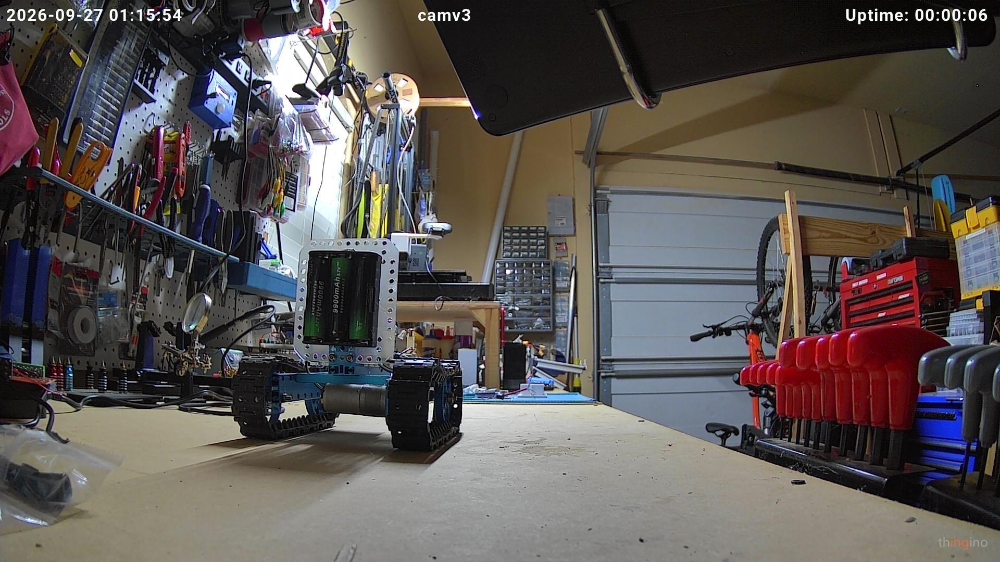
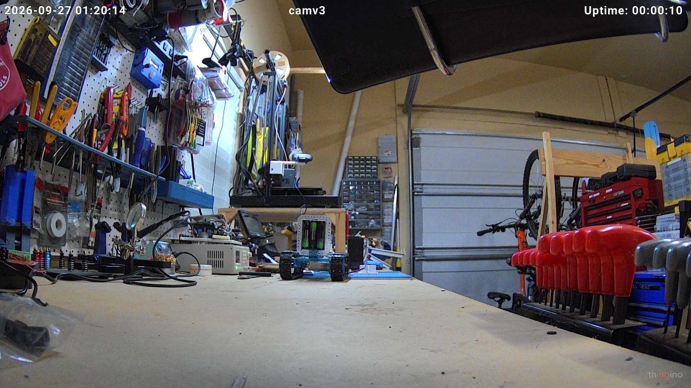
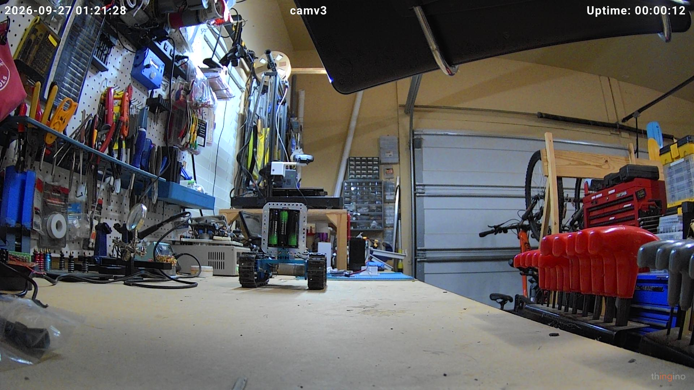

# Grover

A small rover built from Makeblock parts, living on a garage workbench and
learning to look after itself. Named Grover on 2026-09-29: blue rails, and it
spends its life demonstrating *near... far*.

This repo is the whole project: a dated [journal](JOURNAL.md) of what
happened and who decided it, the [bill of materials](BOM.md) against a $100
budget, the [roadmap](ROADMAP.md), the off-board brain, printable hardware,
scripts, and a reference copy of the firmware.

It is a collaborative build between Enoch and Claude (Anthropic). The
journal records which model did the work at each stage and which decisions
were Claude-driven versus Enoch-directed. [CLAUDE.md](CLAUDE.md) is the
standing rulebook (mission, hard constraints, budget policy, permissions,
safety rules learned the hard way) - auto-loaded by Claude Code as project
instructions, and readable as plain English by anyone.

## The mission

1. **Phase 1 (current):** drive around the workbench without falling off.
2. **Phase 2:** recharge itself.
3. **Phase 3:** roam the house.

## Where it stands (2026-09-29)

- **Visual homing works.** `home_to_marker` finds a printed ArUco marker
  with the onboard camera and parks in front of it, unattended - three
  arrivals so far, the latest from 1.1 m away in 7 pulses / 35 s.
- **Chassis is the trike build** (two driven wheels in front, trailing
  caster) - rebuilt from the tank on 2026-09-29 because tank pivots skidded
  the tracks and made turning erratic. Same differential steering.
- **Camera rides on the rover** in a printed cradle bolted to the chassis
  via a printed adapter strip.
- Firmware guards: command watchdog, disconnect-stop, low-battery refusal,
  cliff-sensor refusal (sensors on order), optional brake-on-stop.
- Known hazard: no rear cliff sensors, and reversing a trike is
  unpredictable (the caster flips) - one wheel went over the edge on
  2026-09-29. See the reversing rule in `CLAUDE.md`.

## Architecture

Three layers, decided early and still standing:

| Layer | Hardware | Role |
|---|---|---|
| **Spinal cord** | Wemos D1 Mini (ESP8266), ESPHome | reflexes: watchdog, disconnect-stop, cliff and battery guards, optional brake-on-stop. Authoritative - nothing off-board can override them. |
| **Eyes** | TTGO T-Camera (ESP32-WROVER, OV2640), ESPHome | snapshot and stream endpoints; no decisions |
| **Brain** | `brain/` - Python + OpenCV, off-board | everything with judgment: marker detection, the homing loop, bounded drive pulses. Exposed as an MCP server (`rover-brain`). |

Claude (the model) is *not* in the control loop: it starts a run and reads
the log. A homing run is a plain Python loop - look, decide one pulse,
settle, look again - talking to the rover over ESPHome's native API.

## Hardware

- Chassis: Makeblock Starter Robot Kit, **trike** configuration; two DC gear
  motors, trailing caster
- Controller: Wemos D1 Mini; MCP23008 I2C expander for the four direction
  lines (the D1 Mini is short on pins)
- Motor driver: L298N dual H-bridge (its 0.5 A linear 5 V regulator feeds
  the D1 Mini today; moving to the buck is on the roadmap)
- Power: 3x 18650 Li-ion in 3S (12.6 V full); LM2596 buck at 5 V for the
  camera; battery voltage read through a 100k/27k divider on A0
- Vision: TTGO T-Camera on the rover (fisheye, ~111 deg); a fixed Thingino
  ONVIF camera watches the whole bench and is the second set of eyes
- Homing targets: ArUco 4x4_50 markers, ids 0 (80 mm) and 1 (160 mm),
  printable from `hardware/markers/`
- Coming: two IR cliff sensors (ordered), a Benewake TFMini LiDAR
  (inventory) for obstacle stop and precise stop distance

## Software

- **Firmware:** ESPHome (`firmware/rover.yaml`, `firmware/eufy-ir.yaml` -
  reference copies; the live configs with secrets are in a private repo).
  Custom services `forward`/`backward`/`left`/`right`/`stop`; `Drive duty`
  and `Pivot duty` sliders for live tuning; a `Brake on stop` switch.
- **Brain:** `brain/` - MCP tools `status`, `snapshot(bench|front|rover)`, `set_brake`,
  `drive` (capped at 1 s, refused on low battery or cliff), `find_marker`,
  `home_to_marker`, `stop`. Install with `scripts/install-brain.sh`; details
  in `brain/README.md`.
- **Printing:** parametric OpenSCAD in `hardware/` (camera cradle, adapter
  strip, marker pages, a shelved Roomba plug), sliced with the house rules
  (PETG, no brim, tree supports on auto) and printed through the
  print-warden service; toolchain via `scripts/install-tools.sh`.
- **Scripts:** `rover_ctl.py` (drive over the native API),
  `test_disconnect_safety.py` (proves the disconnect-stop),
  `camera_snapshot.py`, `warden_call.py` (talk to the print-warden from a
  shell). All read hosts and credentials from environment variables.

### Safety design

A device that can drive off a table needs more than "send stop when you
mean it." In the firmware, always on:

- **Command watchdog** - no drive command for 1.5 s -> motors stop.
- **Disconnect-stop** - the API client goes away for any reason -> motors
  stop. Verified by `scripts/test_disconnect_safety.py`.
- **Cliff guard** - a front IR sensor stops seeing the bench -> forward and
  pivots refused (backward stays allowed).
- **Battery guard** - below 9.3 V the rover refuses to drive; resumes at
  9.6 V. Calibrated to within 0.02 V of a multimeter.
- **Brake-on-stop** (switch, currently off) - shorts the motor windings for
  150 ms on every stop. A/B on 2026-09-29 showed no measurable difference on
  0.25 s pulses (the gearmotors barely coast), so it stays off until a
  cruise-speed test says otherwise.

The brain adds courtesy limits on top (pulse cap, gap between pulses,
lost-marker and stuck detection) but never replaces the firmware's.

## Side quest: the house chassis

The house-roaming phase will ride on a **Eufy RoboVac 12** driven over
infrared from an ESP32 (`firmware/eufy-ir.yaml`), keeping the vacuum's own
docking, cliff and bumper behaviour. Codes captured; IR LEDs on order. See
Tier 2E in the roadmap.

## First drive

## Budget

Parts already in Enoch's inventory are supplied by him. Anything else comes
out of a standing **$100 budget** tracked in [BOM.md](BOM.md). Spent so far:
$0.00.

---

Built and driven in collaboration with Claude (Anthropic).
